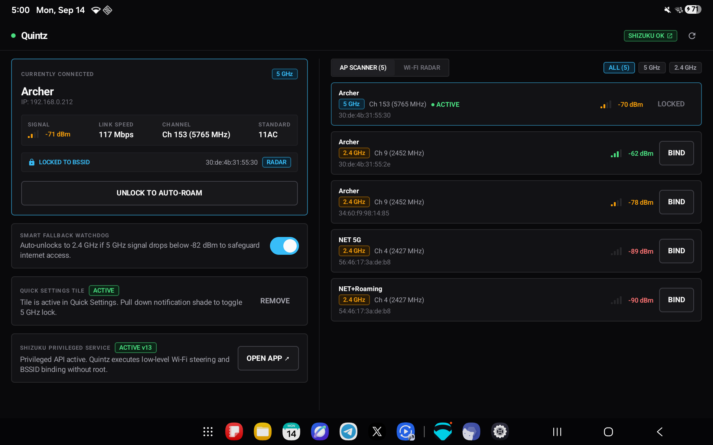
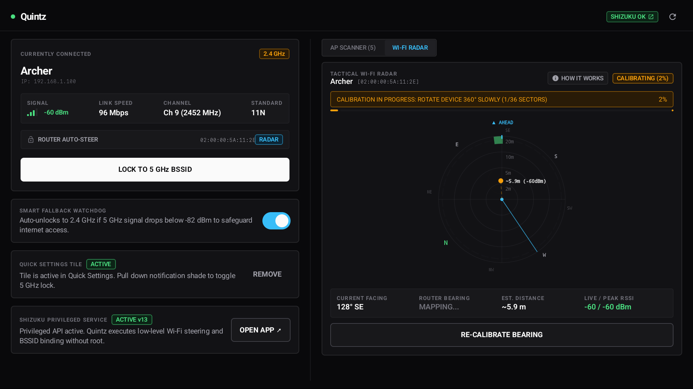
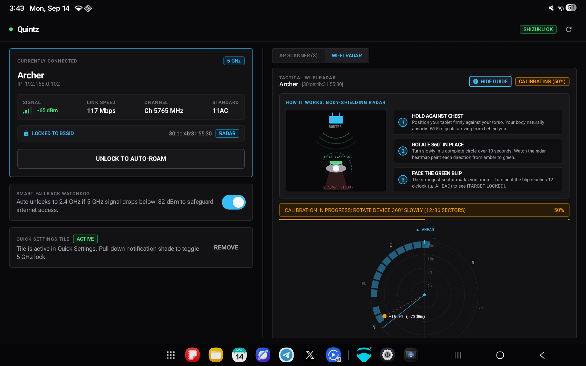

# Quintz ⚡

> **Tactical Wi-Fi Band Locker, BSSID Steering & RF Direction Finder for Android.**

[-3DDC84?style=flat-square&logo=android)](https://developer.android.com)
[](https://kotlinlang.org)
[](https://developer.android.com/jetpack/compose)
[-00C853?style=flat-square)](https://shizuku.rikka.app)
[](LICENSE)

---

## Overview

**Quintz** is a high-performance, rootless Wi-Fi utility designed to solve one of Android's most notorious wireless connectivity issues: **sticky 2.4 GHz roaming on dual-band and mesh networks**.

Modern routers broadcast both 2.4 GHz and 5 GHz (or 6 GHz) under a unified SSID. While 5 GHz delivers gigabit speeds and ultra-low latency, Android’s default roaming logic is notoriously conservative. Once your device steps down to 2.4 GHz, it will stubbornly remain connected to the slower, congested band—even when you walk right back next to the router.

Quintz leverages the **[Shizuku](https://shizuku.rikka.app)** privileged API bridge to lock Android directly to the 5 GHz / 6 GHz radio of your network **without needing root access**, while providing real-time AP telemetry, automated fallback protection, and an RF directional radar.

---

## Screenshots

<div align="center">
  
  <br/><br/>
  
  <br/><br/>
  
</div>

---

## Key Features

### 🔒 1-Tap 5 GHz BSSID Lock (No Root Required)
- Pins the connection to the strongest 5 GHz / 6 GHz BSSID of your network.
- Eliminates unwanted downgrades to 2.4 GHz.
- Supports WPA2-Personal, WPA3-SAE, Enhanced Open (OWE), and open networks.
- Uses Shizuku to interface safely with Android's system Wi-Fi service.

### 🛡️ Smart Fallback Watchdog
- Low-power foreground service continuously tracks live RSSI signal quality.
- **Auto-Unlock**: If you walk into a dead zone where 5 GHz signal remains below `-82 dBm`, the watchdog automatically unlocks the connection to Auto-Roam mode so you never lose internet.
- **Auto-Recovery**: Once you return to an area with strong 5 GHz reception (`≥ -72 dBm`), the watchdog seamlessly re-locks to 5 GHz.
- Built with progressive scan backoff (12s → 30s) to minimize battery impact.

### 📡 Tactical Wi-Fi Radar (RF Direction Finder)
- Directional scanner powered by **RF body shielding** and sensor fusion (gyroscope, accelerometer, magnetometer).
- **Forward-Up Heads-Up Display**: 12 o'clock points where your device is facing (`▲ AHEAD`), while the 360° compass rose rotates with device azimuth.
- **360° Polar Sector Heatmap**: Maps 36 radial sectors with color-coded signal tiers:
  - 🟢 **Green** (`-50` to `-65 dBm`): Peak reception / line-of-sight.
  - 🔵 **Cyan** (`-66` to `-76 dBm`): Moderate reception.
  - 🟠 **Amber / Red** (`< -76 dBm`): Attenuated reception / shadowed.
- Real-time estimated distance and directional alignment prompts (e.g. `TURN LEFT 42° TO FACE ROUTER`).

### 📊 AP Scanner & Channel Analyzer
- Scans and lists all nearby access points, frequencies, channel numbers, and MACs.
- Clear indicators for Wi-Fi standards (**11n**, **11ac**, **11ax**, **Wi-Fi 7**).
- 1-tap **`BIND`** button to pin connection to any specific radio or access point.

### ⚡ Quick Settings Tile
- 1-tap lock and unlock directly from the Android Quick Settings shade without launching the full application.
- Real-time subtitle status shows the active locked channel and band.

### 🔋 Battery & Resource Optimized
- **Zero background shell execution** when the app is idle or minimized.
- Network callbacks are foreground-gated and strictly throttled.
- Canvas graphics allocations are pre-cached, eliminating garbage collection pauses during 60/120 FPS animations.

---

## Prerequisites

- **Android 10** (API 29) through **Android 15 / 16** (API 35+).
- **[Shizuku](https://shizuku.rikka.app)** (v13+ recommended).

### Why Shizuku?
Since Android 10, Google restricted third-party applications from programmatically managing Wi-Fi networks and BSSID associations. Shizuku runs a privileged system service that lets user apps execute authorized system shell commands without modifying Android system files or rooting your device.

**Setting up Shizuku takes ~1 minute on your device:**
1. Install [Shizuku from Google Play](https://play.google.com/store/apps/details?id=moe.shizuku.privileged.api) or GitHub.
2. Open Shizuku and follow the on-screen steps to start it via **Wireless Debugging** (no computer required).
3. Open **Quintz** and tap **GRANT** when prompted.

---

## Building from Source

### Requirements
- **JDK 21**
- **Android SDK** (API 35, Build Tools 35.0.0+)
- **Git**

### Steps

1. **Clone the repository:**
   ```bash
   git clone https://github.com/corgilittlelegs/Quintz.git
   cd Quintz
   ```

2. **Build the release APK:**
   ```bash
   ./gradlew assembleRelease
   ```

3. **Install to your connected device via ADB:**
   ```bash
   adb install -r app/build/outputs/apk/release/app-release.apk
   ```

---

## Architecture & Tech Stack

- **Architecture**: MVVM with unidirectional data flow (UDF) via Kotlin Coroutines and `StateFlow`.
- **UI Framework**: 100% Jetpack Compose with Material 3 and custom industrial cyber-tactical CLI design tokens.
- **Sensors**: Hardware sensor fusion (`Sensor.TYPE_ROTATION_VECTOR`) with orientation coordinate remapping across portrait and landscape layouts (`SensorManager.remapCoordinateSystem`).
- **Security**: Local network credentials encrypted using AndroidX `EncryptedSharedPreferences`.
- **System Integration**: Shizuku IPC binder bridge to `cmd wifi` and `dumpsys wifi` system services.

---

## Privacy & Security Guarantee

- **100% Offline**: Quintz contains **no tracking**, **no analytics**, **no ads**, and makes **no internet network requests**.
- **Local Credentials**: Any Wi-Fi passwords entered are saved exclusively on your local device within hardware-backed encrypted storage (`EncryptedSharedPreferences`).
- **Open Source**: Full source code is available for audit and verification.

---

## Third-Party Open Source Credits & Acknowledgments

Quintz relies on and thanks the following open source projects:

- **[Shizuku](https://github.com/RikkaApps/Shizuku)** by [Rikka Apps / RikkaW](https://github.com/RikkaApps)  
  *Licensed under the [Apache License 2.0](https://www.apache.org/licenses/LICENSE-2.0)*  
  Enables rootless privileged API execution on Android devices.

- **[Android Jetpack & Jetpack Compose](https://developer.android.com/jetpack)** by [Google / AOSP](https://source.android.com)  
  *Licensed under the [Apache License 2.0](https://www.apache.org/licenses/LICENSE-2.0)*  
  Modern UI toolkit, AndroidX lifecycle, architecture components, and crypto security.

- **[Kotlin & Kotlinx Coroutines](https://github.com/Kotlin/kotlinx.coroutines)** by [JetBrains](https://www.jetbrains.com)  
  *Licensed under the [Apache License 2.0](https://www.apache.org/licenses/LICENSE-2.0)*  
  Asynchronous stream processing and state management.

- **[JetBrains Mono](https://www.jetbrains.com/lp/mono/)** by [JetBrains](https://www.jetbrains.com)  
  *Licensed under the [SIL Open Font License 1.1](https://scripts.sil.org/OFL)*  
  Monospace typography used across telemetry readouts.

---

## License

This project is licensed under the **MIT License** — see the [LICENSE](LICENSE) file for details.
